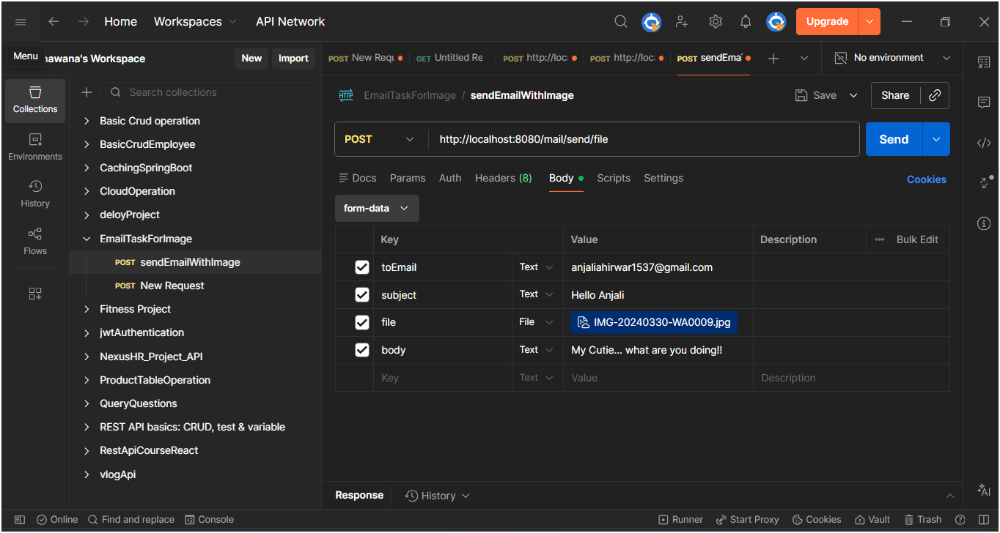

# ✉️ Email Sender Application (Spring Boot)

A simple and powerful Email Sending System built using Spring Boot that allows sending emails with **HTML content, file attachments (Image/PDF), and dynamic messages** using Gmail SMTP.

---

# 🚀 Features

- Send simple text emails  
- Send HTML formatted emails  
- Send attachments (Image / PDF / Files)  
- Dynamic message support via Postman  
- Gmail SMTP integration  
- REST API based structure  
- Form-data (Multipart request) support  

---

## 🔗 Project Links

### 🌐 Live Application

https://emailsender-whmv.onrender.com

### 📖 Swagger API Documentation

https://emailsender-whmv.onrender.com/swagger-ui/index.html

### 💻 GitHub Repository

https://github.com/Bhawana-A/EmailSender

---

# 🛠 Tech Stack

- Java 17+
- Spring Boot
- Spring Mail (JavaMailSender)
- Maven
- Gmail SMTP

---

# 📬 API Endpoint

- POST `/mail/send` → Send email with optional attachment (form-data)

---

# 📦 Working Flow

1. User sends request from Postman (form-data)  
2. Controller receives email data  
3. Service builds HTML email template  
4. File attachment added if provided  
5. Email sent via Gmail SMTP  

---

# 🖼️ Project Screenshots

## Controller

---

---

# 📎 Use Cases

- Sending welcome emails  
- Sending notifications with attachments  
- Sharing reports (PDF/Image)  
- HTML formatted emails  

---

# 👩‍💻 Author

**Bhawana Ahirwar**  
Java & Spring Boot Developer 🚀
